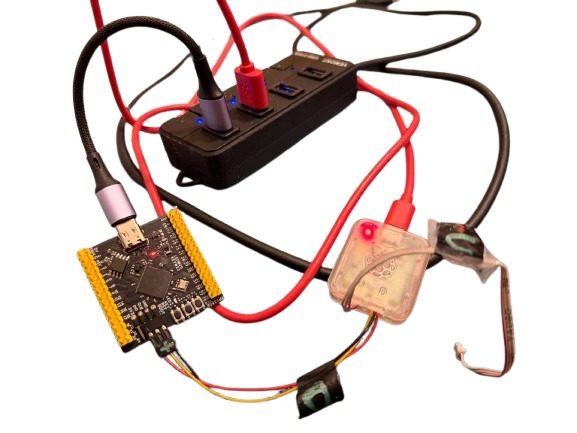

# rp2350-simple-psram-project

A test VS Code project with everything bundled and configured, including working binaries in the build/ folder.

Edit CMakeLists.txt and set the add_definitions(-DSFE_RP2350_XIP_CSI_PIN=0) value to match your wiring.

The current wiring configuration is for the WEACT RP2350B board with PSRAM attached to CSI pin 0.



Original project link:
https://github.com/sparkfun/sparkfun-pico/

```
https://github.com/therealdreg/rp2350-simple-psram-project

-----------------------------------------------------------
SparkFun - Basic PSRAM Test - starting
PSRAM setup complete. PSRAM size 0x800000
Generating Random Data
PSRAM data block testing - n data blocks: 512
Data blocks written
....................................................

Test Run: 512, Passed: 512, Failed: 0
DONE
-----------------------------------------------------------

-----------------------------------------------------------
SparkFun - Allocator test - starting
Startup
        Memory pool - Total: 0x7FF500 (8385792)  Used: 0x0 (0) - 0.00%
        Max free block size: 0x7FF500 (8385792)

Allocated a Meg using sfe_alloc
        Memory pool - Total: 0x7FF4FC (8385788)  Used: 0x100000 (1048576) - 12.50%
        Max free block size: 0x6FF4FC (7337212)

Freed a Meg using sfe_free
        Memory pool - Total: 0x7FF500 (8385792)  Used: 0x0 (0) - 0.00%
        Max free block size: 0x7FF500 (8385792)
DONE
-----------------------------------------------------------
```